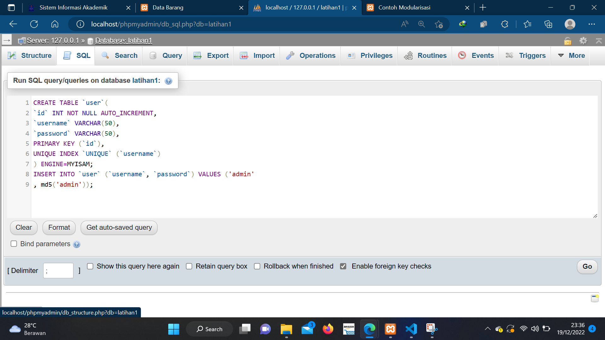
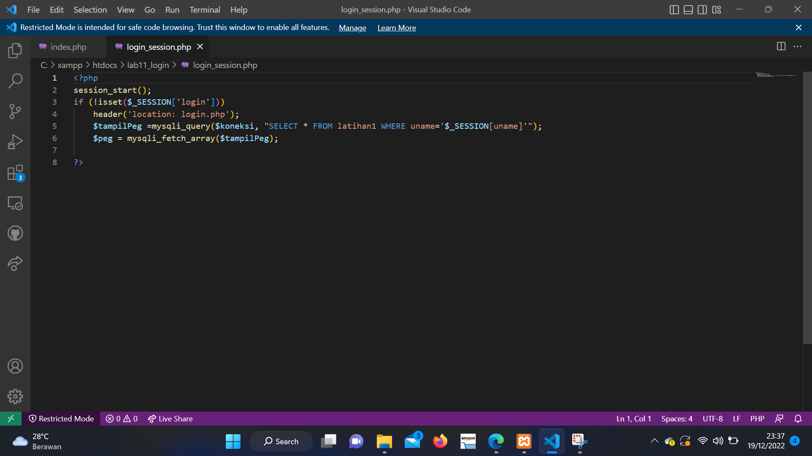
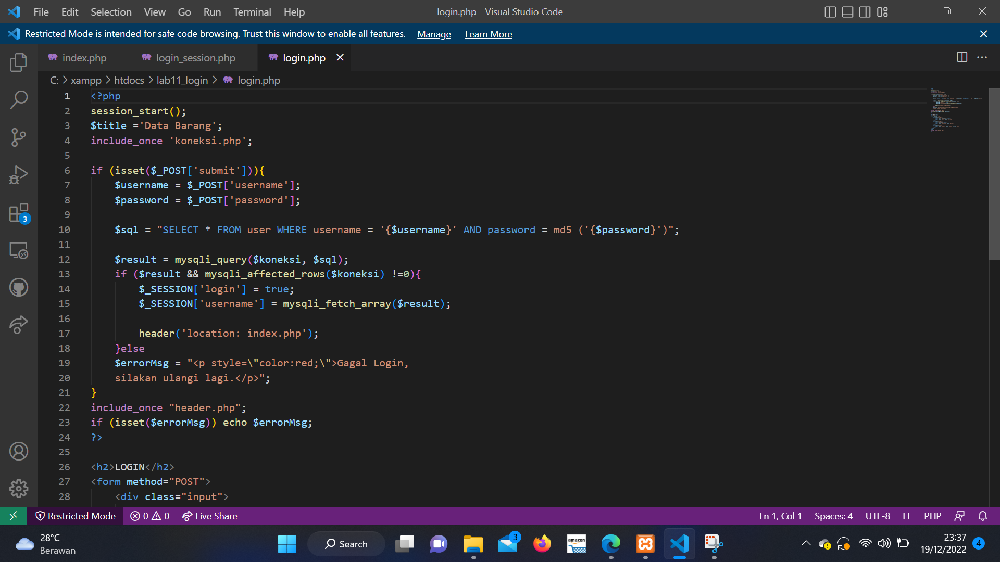
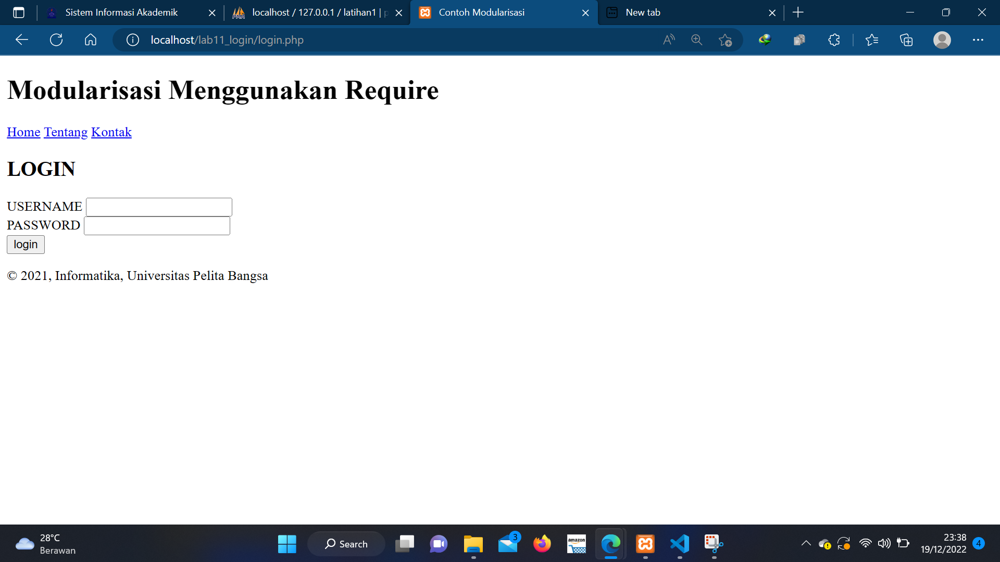
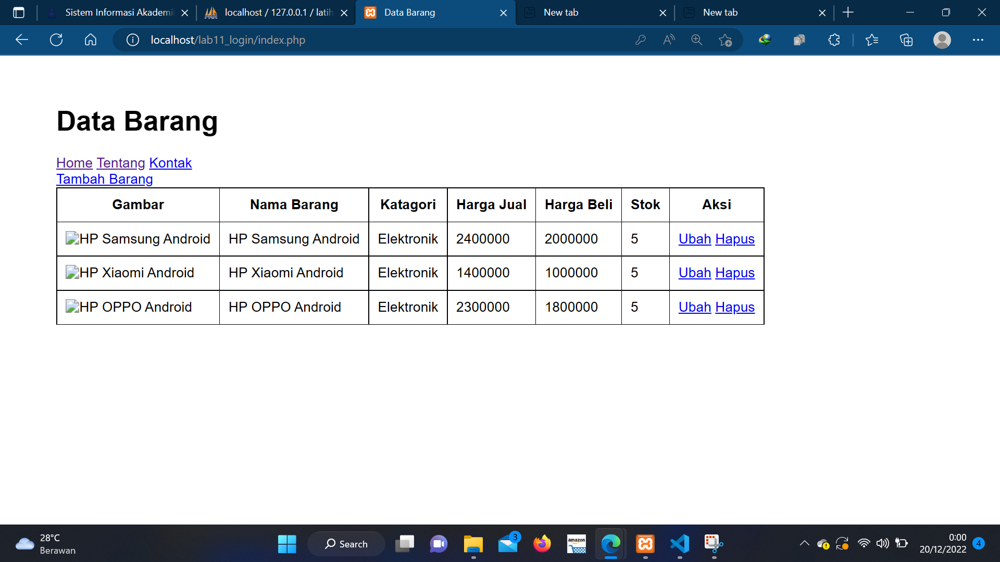

# Lab11Web

## Praktikum: PHP dan MySQL Database
## Studi Kasus: Login Form

### buat Table user

### buat File: login_session.php
Deskripsi: dignakan untuk pengecekan sesi login, file ini nantinya akan di include di
setiap halaman yang membutuhkan login.

### kemudian buat File: login.php

dan hasil nya

